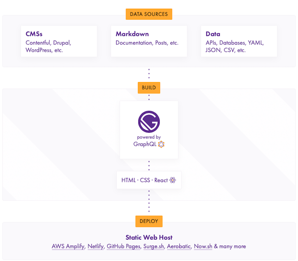

# Welcome

---

# Thanks

---

# Who are we

---

# Decoupled, decoupled, decoupled...

---

# JSON:API in core

---

# Introducing   
# GatsbyJS

---

# What’s GatsbyJS

- Gatsby is a free and open source developer framework
- Based on React
- Generates Static instances of websites and apps

---

# Why a static website?
- Static site generators pre-generate all the pages of the website
- No more live database querying and no more running through a template engine
- Performance goes up and the maintenance cost goes down

---

# How Gatsby works

via https://www.gatsbyjs.org

---

# We are not Gatsby experts… (yet!)

---

# Create a Blog with Drupal 8 + Gatsby

---

# GraphQL

---

# GraphiQL

---

# Querying

---

# gatsby-config.js

---

# Template
