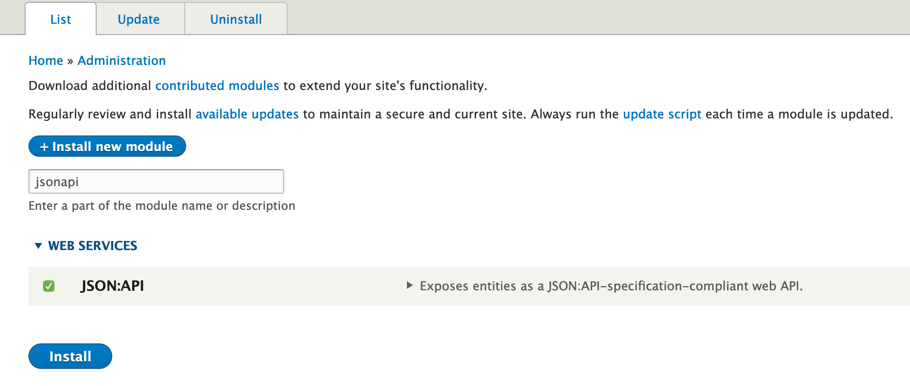
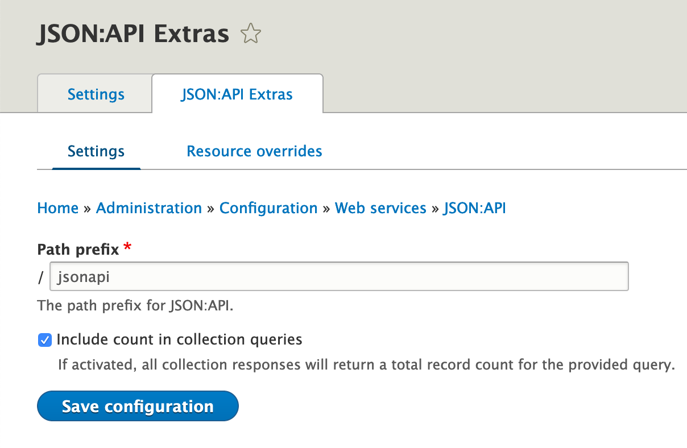
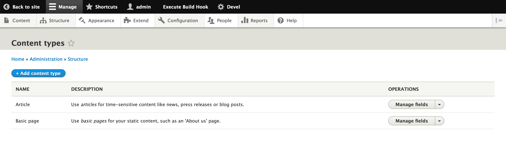
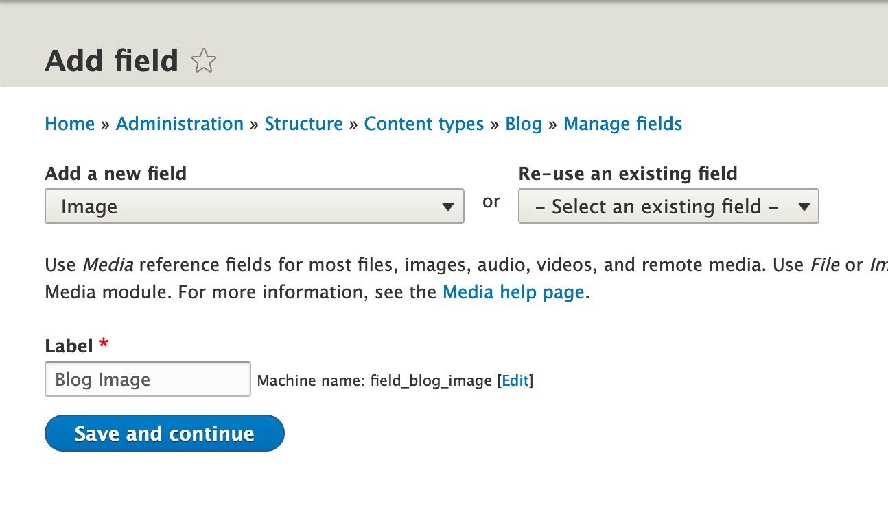
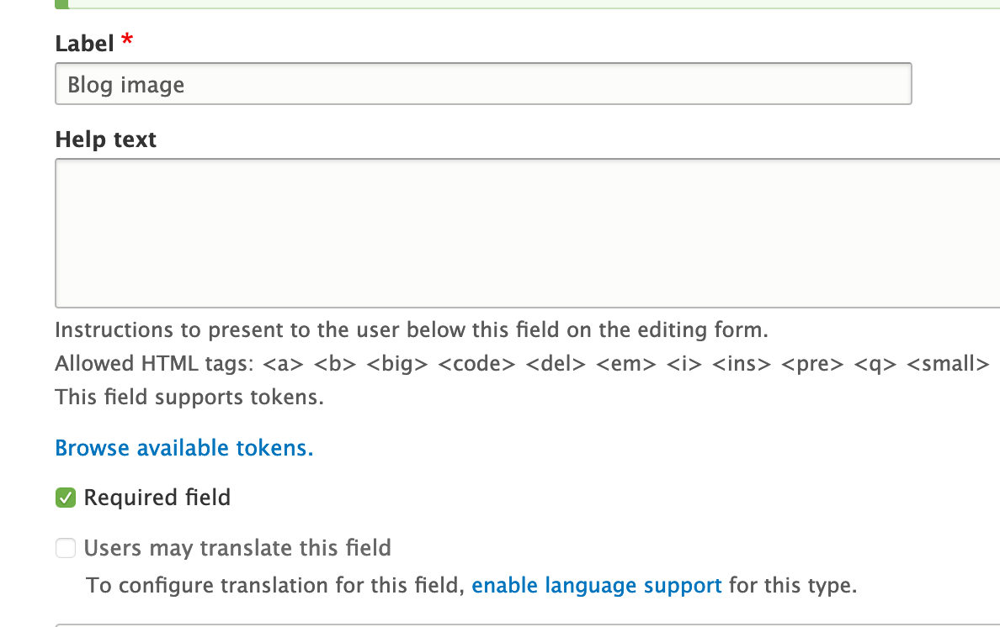
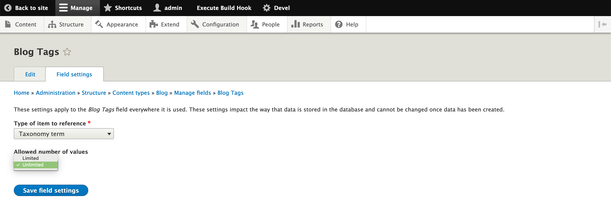

# Decoupled, decoupled, decoupled...

---

# What's Drupal Decoupled
_“The use of Drupal as a content service
for consumption by other applications”_

- **Fully decoupled**: complete separation between Drupal and consumer applications
- **Progressively decoupled**: provides a middle ground by interpolating Javascript Frameworks into Twig

---

# What’s GatsbyJS


- Gatsby is a free and open source developer framework
- Based on React
- Generates Static instances of websites and apps

---

# Why a static website?
- Static site generators pre-generate all the pages of the website
- No more live database querying and no more running through a template engine
- Performance goes up and the maintenance cost goes down

---

# How Gatsby works

via https://www.gatsbyjs.org

---

# GraphQL

GraphQL is an open-source data query and manipulation language for APIs,  
and a runtime for fulfilling queries with existing data.

---

# Do I have to know React and GraphQL?

React and GraphQL are the fundamentals of Gatsby,  
but if you don’t know them yet,  
you can take advantage of Gatsby to learn them.

---

# We are not Gatsby experts… (yet!)

---

# How to integrate a blog with Drupal 8 + GatsbyJS


- Build a Drupal server
- Build a Gatsby site
- Fetch content from the Drupal server
- Publish the Gatsby site

---

# Build a Drupal server

1. A basic Drupal website running
2. Enable the module `jsonapi`  
  * **(Optional)** Download and enable module `jsonapi_extras`  
  `composer require drupal/jsonapi_extras`  
3. Check if your Drupal API works:  
  `http://[your-site.tld]/jsonapi`

---

# Drupal quick installation

<br />


## Windows and MacOS users:
https://www.acquia.com/drupal/acquia-dev-desktop  

<br />

## Linux users:

https://www.drupal.org/docs/8/install/drupal-8-quick-start-command

---

# Enable JSON:API module

<div class="w-60vw">



</div>

### or

<div class="no-margin-pre-wrapper">

```
$ drush en jsonapi
```

</div>

---

# Download and enable `jsonapi_extras`

https://www.drupal.org/project/jsonapi_extras

### or

<div class="no-margin-pre-wrapper">

```bash
$ composer require drupal/jsonapi_extras
$ drush en jsonapi_extras

```

</div>

___

# Module `jsonapi` and `jsonapi_extras` enabled


---

# JSON:API Extras options


---

# JSON:API Extras options


---

# Configure `Blog` entity in Drupal

---

# Add new content type


---
# Create Blog content type


---
# Add fields to Blog content type


---

# Add field Blog Image


---
# Add field Blog Image


---
# Add field Blog Tags


---
# Add field Blog Tags


---
# Add field Blog Tags


---
# Add field Blog Tags


---
# Setup field Blog Tags
<div class="w-60vw shadowed-images-wrapper">


### [...]

</div>

---

# Create Blog content


---

# Publish Drupal Server
## We don't need it, Drupal can stay on your localhost!
##### (thanks to the magic of a static website)

---

# Build a Gatsby website

Requirements:
- Node.js - [https://nodejs.org](https://nodejs.org)
- npm (included in Node.js installation)
- git (starter dependency) - [https://git-scm.com/downloads](https://git-scm.com/downloads)

**Install:**  
`npm install --global gatsby-cli`

---

# GatsbyJS - New Project

### Create a new project from gatsby starter in ./drupalgatsby

`gatsby new drupalgatsby`

---

# GatsbyJS - New Project

### Enter the project directory

`cd drupalgatsby`

---

# GatsbyJS - New Project

### Start a hot-reloading development server on `localhost:8000`

`gatsby develop`

---

# Gatsby project structure
```
/  
|-- /.cache  
|-- /plugins  
|-- /public  
|-- /src  
    |-- /pages  
    |-- /templates  
    |-- html.js  
|-- /static  
|-- gatsby-config.js  
|-- gatsby-node.js  
|-- gatsby-ssr.js  
|-- gatsby-browser.js  
```
Gatsby projects are actually React apps, so it’s common to use standard React code organization patterns such as folders like `/components` and `/utils` inside `/src`.

---

# GatsbyJS - Drupal Integration

### Install the source plugin
`npm install --save gatsby-source-drupal`

---

# GatsbyJS - Drupal Integration

### Add configuration for the source plugin:
### In `gatsby-config.js`

```
plugins: [

  ...

  {
    resolve: 'gatsby-source-drupal',
    options: {
      baseUrl: 'http://drupalgatsby.test/', //our development base URL
      apiBase: 'jsonapi', // endpoint of Drupal server
    },
  }
],
```

---

# GraphQL - GraphiQL

Look for our data with GraphiQL  
GraphiQL is an in-browser IDE for writing, validating, and testing GraphQL queries  
 `http://localhost:8000/___graphql`

---

# Blog page

### /src/pages/blog.js

```
import React from "react"

const Blog = () => (
  <>
    <h1>Blog</h1>
    <p>Here we will list our articles</p>
  </>
)

export default Blog

```
---

# Fetch Drupal data with GraphQL

```
import { graphql } from "gatsby"

[…]


const Blog = ({ data }) => {
...
}

```
---

# Fetch Drupal data with GraphQL

```
export const query = graphql`
  query allNodeArticle{
    totalCount
    edges{
      node{
        title
        created
        path{
          alias
        }
        body{
          processed
          summary
        }
        relationships{
          field_blog_tags{
            name
          }

          ...

        }
      }
    }
  }
`
```
---

# Fetch Drupal data with GraphQL -- Images

```
...

relationships{

  ...

  field_blog_image{
    filename
    localFile{
      childImageSharp{
        fluid(sizes: "(max-width: 1200px) 100vw, 800px") {
          src
          ...GatsbyImageSharpFluid_noBase64
        }
      }
      relativePath
      absolutePath
    }
  }
}

...
```

---
# Generate BlogPost nodes
`npm install --save transliteration`  
  
[https://github.com/karma0321/gatsby-drupal-blog/blob/opensouthcode-2019/gatsby-node.js](https://github.com/karma0321/gatsby-drupal-blog/blob/opensouthcode-2019/gatsby-node.js)  

add **this** code to `gatsby-node.js`  

---

# Create BlogPost template
### In `/src/templates/BlogPost.js`

```
import { graphql } from "gatsby"

[…]


const BlogPost = ({ data }) => {

...

}

```
---

# GatsbyJS - Deploy

`gatsby build`

- Once finished, checkout `/public` folder to see result of your hard work
- Deploying your site is now simply copy/push contents in `/public` to your server


---

# Resources

**Gatsby Website**
[https://www.gatsbyjs.org/](https://www.gatsbyjs.org/)

**This presentation**
https://github.com/karma0321/drupal-gatsby-presentation-soulweb

**The code of our GatsbyJS site**
https://github.com/karma0321/gatsby-drupal-blog

---
# Q&A

---

# Thanks!!
